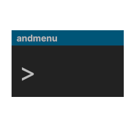
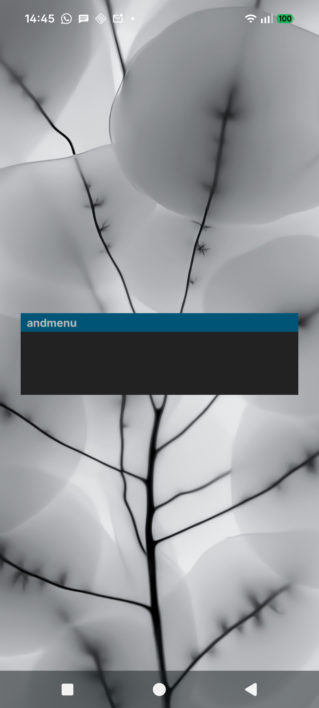
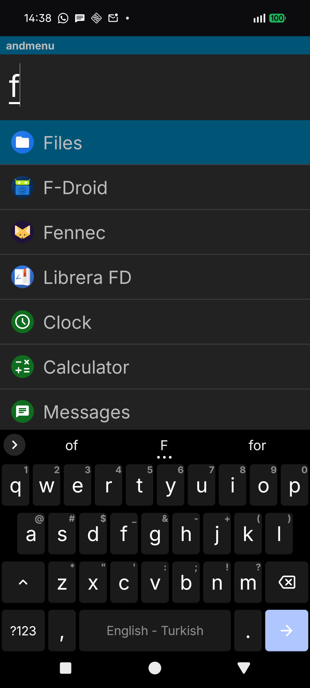
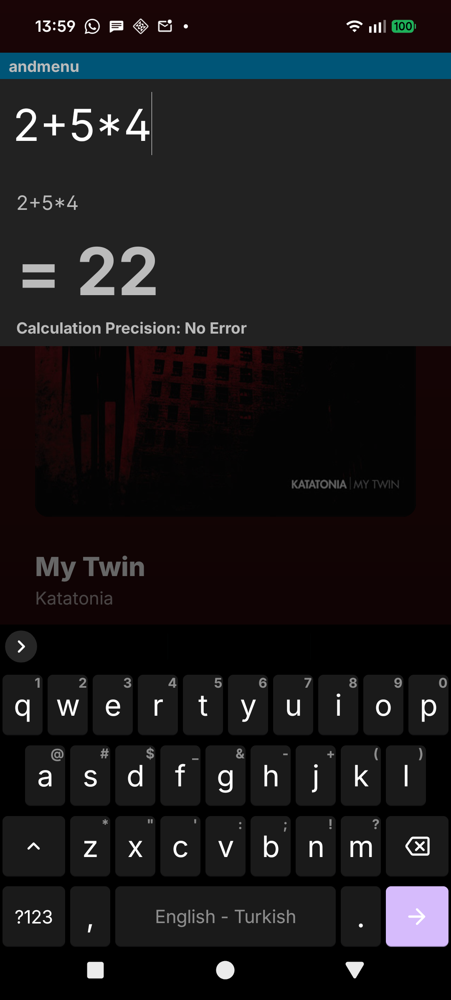

##  andmenu

Keyboard based launcher for Android

### Screenshots
  

### TODO
- [x] Fuzzy search option
- [x] Sort by usage freq. option
- [x] New search engines (ecosia, maps, yt, yt music, etc)
- [ ] Custom commands
- [ ] Search files, images etc
- [ ] Todo or note taking
- [x] Long press apps to show app info, uninstall, hide and rename
- [x] New themes (dmenu, gruvbox, rosepine, etc)
- [x] Set as default launcher option
- [x] Set wallpaper or solid color

---
#### Attribution 
[Blue Line Console](https://github.com/nhirokinet/bluelineconsole)
